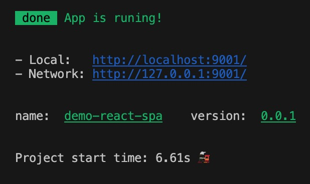
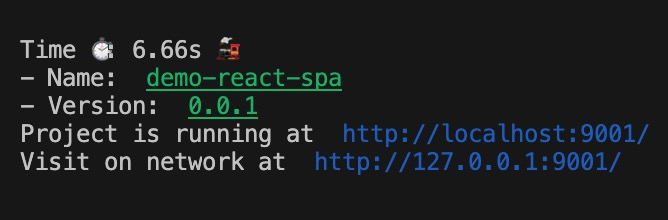
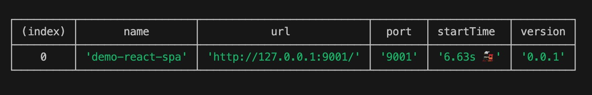
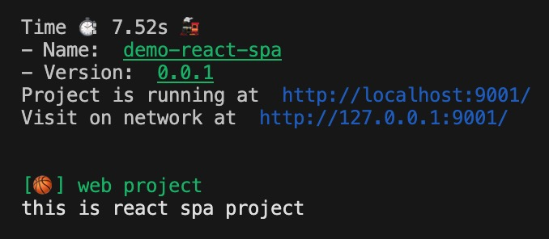

# webpack-prompt-plugin

Used to prompt ip link and some other information when webpack-dev-server Successfully started

### usage

install
```code
yarn add webpack-prompt-plugin --dev
```

或者
```code
pnpm install webpack-prompt-plugin -D
```

```js
const webpackPromptPlugin = require('webpack-prompt-plugin');

module.exports = {
  // ...
  plugins: [
    new webpackPromptPlugin()
  ],
}
```

```js
// 带参数
module.exports = {
  // ...
  plugins: [
    new WebpackPromptPlugin({
      tips: [
        {
          name: '[🏀] web project',
          color: 'green'
        },
        'this is react spa project'
      ],
      style: 'table'
    })
  ],
}
```

### Instance attributes
### style `'default' | 'text' | 'table'`
- `default`

  

- `text`

  

- `table`

  


default style is `default` 😂

#### tips: `Array<{ text: string, color?: string } | string>`
Prompt message queue, array object or string array can be
```code
{
  tips: [
    {
      name: '[🏀] web project',
      color: 'green'
    },
    'this is react spa project'
  ],
}
```

